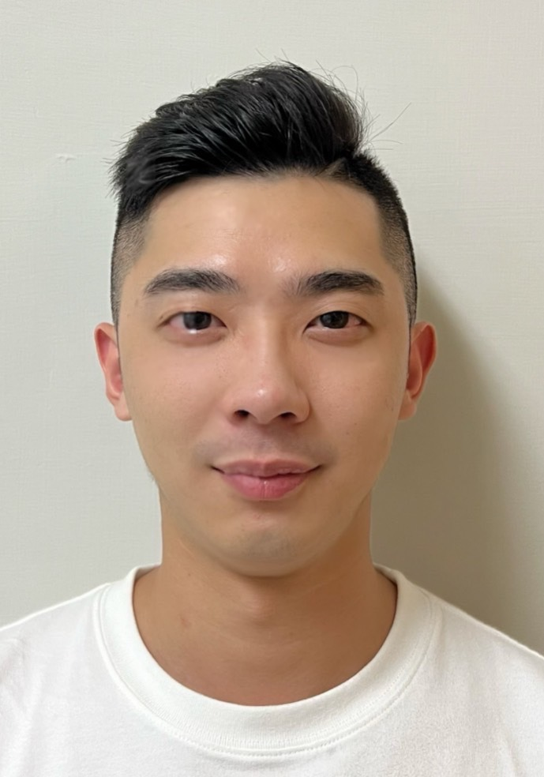

# 黃浩庭 Tim Huang

**Java 後端／系統設計（SD）｜主導銀行遺留系統重構與 AI 導入 SDLC｜AWS AIF & CLF 雙認證**

<hhtonwork@gmail.com> | 0928-005-568 | 新北市

---

## 專業摘要

3 年 Java 後端開發與系統設計經驗，現任職國泰世華銀行擔任 SD（系統設計）角色（另有 5 年航空業跨域歷練）。

- **系統設計與團隊領導**：主導系統架構設計、撰寫 SD 規格書，帶領 2 位 PG 開發並執行 Code Review
- **遺留系統重構**：經手 IBM AS/400 模組拆分、跨站 SSO、BFF 架構設計等大型重構專案
- **AI 導入 SDLC**：2026 年起主導 AI 工具導入銀行開發流程，推動團隊走向 Agentic AI 協作模式
- **AWS 雙認證**：持有 AWS Certified AI Practitioner（AIF-C01）與 Cloud Practitioner（CLF-C02）

---

## 技術能力

- **後端（主力）**：Java 8／17、Spring Boot、RESTful API 設計
- **資料庫**：PostgreSQL、MySQL、Oracle DB、IBM DB2、Redis
- **前端**：Angular、Vue.js、JavaScript、jQuery、HTML／CSS／SCSS、Bootstrap（RWD）
- **雲端與部署**：GCP（Cloud Run、Cloud Storage、Artifact Registry、Cloud SQL）、AWS（持 AIF／CLF 認證）、Docker、Kubernetes、CI／CD、Git／GitHub、TFS（Azure DevOps Server）
- **AI 輔助開發**：Claude Code、GitHub Copilot、OpenAI Codex、OpenClaw（Agent 工作流串接）
- **遺留系統重構經驗**：JSP／Servlet、Struts2、Hibernate、PHP（CodeIgniter）、IBM AS/400

---

## 工作經歷

### 國泰世華商業銀行｜全端工程師（擔任 SD／系統設計） | 2024/06 – 至今

- **系統設計**：透過行內 SDK 規劃系統組成結構與模組劃分，制定應用核心準則與功能流程；定義資料庫結構、關聯與欄位
- **系統分析**：撰寫 SD 技術規格書，梳理業務邏輯（Mermaid 流程圖）與前後端 API 介接，交由工程師開發
- **團隊管理**：與 SA／PM 協商專案時程與驗測時間；對 PG 執行 Code Review，把關品質與行內規範；交付維運前以功能、模組為單位完成測試驗證
- **內部講師**：兩屆擔任行內 Spring Boot 正式教育訓練課程講師，授課對象為新進工程師／儲備幹部（2025/08 梯次 30 人、2026/03 梯次 6 人），課程從網路基礎、API 概念到 Spring Boot IoC/DI 機制與實作；滿意度約 97 分（估算），學員結訓後皆順利進入專案成為即戰力，為業務單位減少培訓負擔

**AI Scrum Team（2026/01 – 至今）**：主導 AI 納入銀行 SDLC 的流程建置，推動團隊從輔助型 AI 走向 Agentic AI 協作模式。

- **SDLC 協作架構設計**：設計 AI 協作前後的 SDLC 對比架構——BU 以 Claude 生成初稿供 UI/UX 驗核、SA 文件直接產出程式碼框架、PG 轉型為 PR Reviewer、OpenClaw 擔任 QA 角色
- **團隊 Skill 開發與整合**：基於行內 SDK 建構團隊專屬 Skill，串接 OpenClaw 擔任團隊「第七人」，自動化處理 PR Review、Cron Job 排程等日常工作流程
- **效益量化評估**：以量化指標衡量 AI 協作效益，提升開發效率並縮減約 30% 人力成本（估算）

**RET 信託輔助系統（2025/04 – 2025/10）**：擔任 SD，主導 IBM AS/400 遺留系統模組拆分重構，帶領 2 位 PG 開發。

- **BFF 架構設計**：首次設計多模組共用單一 BFF 層架構，將 BFF 作為 API Gateway 與身分認證層，降低各模組與後端的直接耦合
- **批次作業設計**：導入批次下檔作業，支援大量資料匯出需求

**APInfo 資訊管理平台（2024/07 – 2025/03）**：擔任 SD，主導全新系統的架構設計與跨職能協作。

- **效能優化**：觀察系統大量 I/O 處理瓶頸後，提出以 Stored Procedure 重構資料處理流程，將讀檔、存庫、下檔作業由 4–6 小時縮減至 10–20 分鐘，**節省 95% 以上等待時間**
- **架構設計與任務分派**：使用行內 SDK 設計系統架構；分析 SA 規格書並拆解為 SD 規格書，分派 2 位 PG 開發
- **跨職能協作**：與 SA 協同設計資料庫 Schema、與 PM 對齊開發時程；對 PG 執行 Code Review 確保符合行內規範

**WMS 財富管理平台（2024/06 – 2024/07）**：負責將 Struts 2／Spring MVC／Vue 架構重構為 Angular／Spring Boot。

- **跨站 SSO 設計**：針對新舊站需並行兩年的限制，以 Token + DB 白名單機制實作跨站 SSO，讓舊站 Session 驗證與新站 Redis Token 機制並行不衝突
- **Session 並行機制**：設計新站定期心跳觸發舊站 keepalive endpoint，避免使用者於新站操作時被舊站閒置登出

### 潤新資訊股份有限公司｜Java 後端工程師 | 2023/07 – 2024/06

負責後端 API 開發、專案 Git 版本控制與 PR 控管；並參與需求訪談、服務建議書撰寫與政府標案簡報。一年內橫跨金融、出版、電商三個產業的系統開發。

**Compass 電商物流中台（2024/04 – 2024/06）**：負責開發中台串接 SiteGiant、Goodmaji 與 Ragic，支援台灣賣家於馬來西亞上架與物流追蹤。

- **通用轉換層設計**：統一處理三方 API 規格差異與不一致的回傳型別
- **排程同步**：以排程任務定期同步物流狀態，透過 RestTemplate 封裝 HTTP 請求

**龍騰出版社後台管理系統重構（2024/01 – 2024/04）**：負責將 PHP（CodeIgniter）後台以 Spring Boot 全面翻寫，解決效能與擴充瓶頸。

- **效能優化**：沿用 MySQL 並擴充 Schema，導入 Redis 快取提升讀取效能；圖片改存 Cloud Storage、資料庫僅存 URL 以節省空間
- **容器化部署**：建立 Docker → Artifact Registry → Cloud Run 的部署流程

**合作金庫個人網銀中台架構提升（2023/07 – 2024/06）**：擔任後端工程師，負責個人網銀前後端分離重構的後端 API 設計。

- **架構重構**：將個人網銀由 JSP／JSF 重構為前後端分離架構（Angular + Spring Boot）
- **機敏系統介接**：對接 IBM DB2 與銀行電文系統，安全存取客戶機敏資料；反組譯行內封裝 .jar，將私有 API 整合至新架構
- **效能與安全**：以 JMeter 壓測定位效能瓶頸並優化；依弱點掃描報告改善程式碼安全性

### 長榮航空股份有限公司｜地勤人員／貨運營業部（助理副課長） | 2017/08 – 2023/02

- 桃園機場櫃台劃位、報到、行李托運與簽證檢查；疫情後調任貨運營業部，負責班機貨物艙位安排、接洽貨運代理商與運價協商
- 5 年半第一線服務與商業協商經驗，奠定跨部門溝通與利害關係人協調能力

---

## 教育與培訓

**緯育 TibaMe｜Java 雲端服務開發技術養成班** | 2023/02 – 2023/06

- 擔任組長帶領團隊完成結訓專案「Time To Travel」訂房平台（Java 17 + Spring Boot + MySQL），主導專案構想、ER-Model 設計、資料庫建置與 GitHub 分支管理

**銘傳大學｜休閒遊憩管理學系 學士** | 2012/09 – 2016/06

---

## 證照

- **AWS Certified AI Practitioner（AIF-C01）**｜人工智慧從業人員 | 2025/10 – 2028/10
- **AWS Certified Cloud Practitioner（CLF-C02）**｜雲端從業人員 | 2026/03 – 2029/03
- 金融市場常識與職業道德｜台灣金融研訓院

---

## 語言能力

- **英文**：中上（TOEIC 690），可閱讀技術文件、進行日常工作溝通
- **日文**：日常會話程度（曾赴日本鶴雅集團飯店實習）
